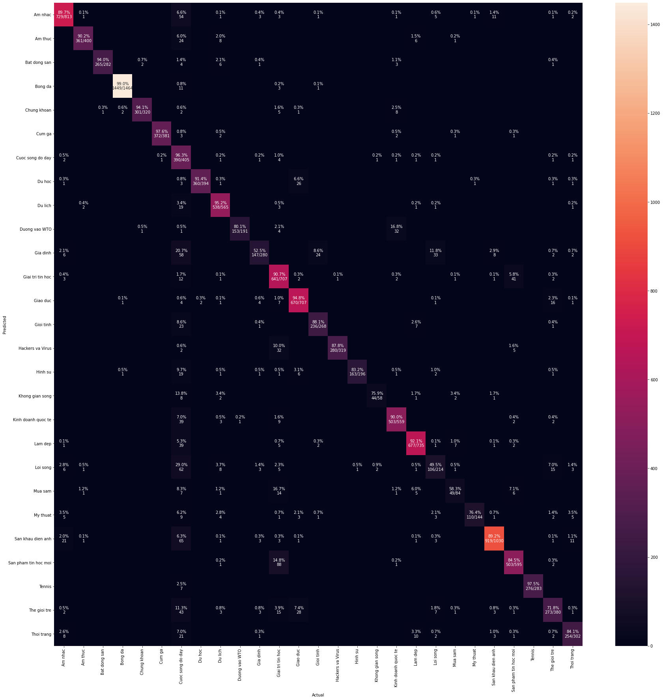
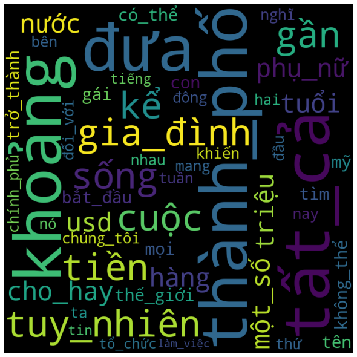

# news-classification
Classify 27 news categories such as: Soccer, Shopping, Lifestyle, etc.

If you can't view ipynb file in GitHub, using https://nbviewer.jupyter.org/ instead.

# Heat Map for Confusion matrix

# Visualize topic's vocabulary with Word Cloud

